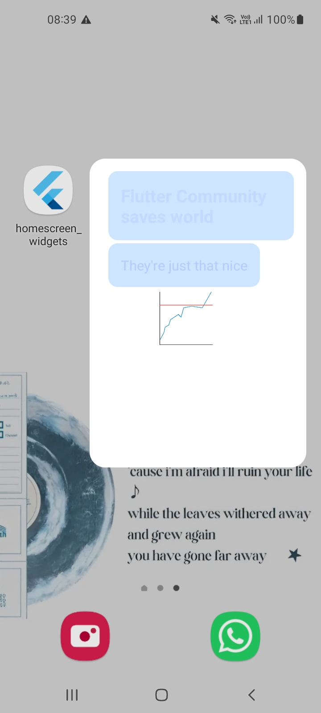

Fazer o codelab abaixo.
Salvar o projeto no Github.
Evidenciar a execução identificando o nome do aluno na Tela Inicial (no Titulo da Aplicação).

https://codelabs.developers.google.com/flutter-home-screen-widgets?hl=pt-br&authuser=1#0

## Execução do código

