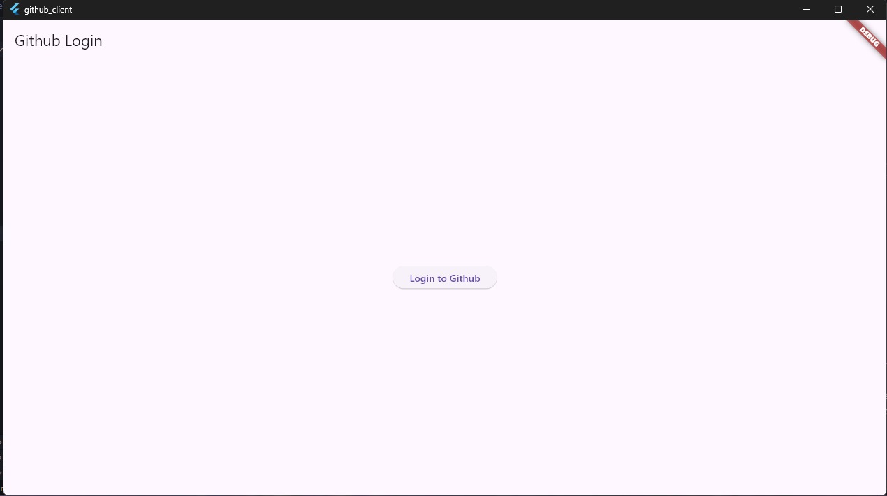
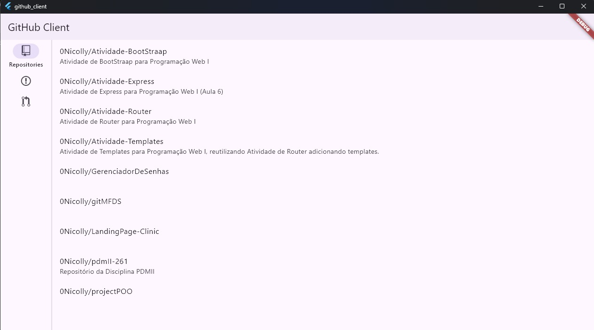

Executar o Codelab Anexo. Mostrar a sua implementação no desktop.
Evidenciar o código no Github.
Postar o link do Github no Google Classroom.

https://codelabs.developers.google.com/codelabs/flutter-github-client?hl=pt-br&authuser=1#0

## Execução do código

